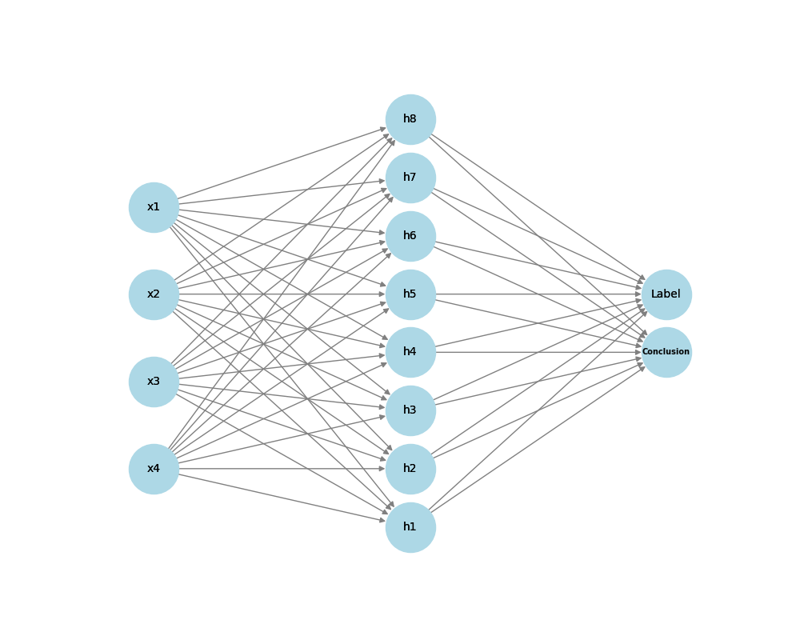

 

# AI Text Analysis: Psychological Influence Detection

A research-based software designed to **detect psychological and emotional manipulation** in texts using a combination of classic algorithms and neural networks.  
Built with **Unity (C#)** for the interface and **Python** for AI processing, this system analyzes user input and provides a detailed breakdown of potential influence techniques.


---

## 📌 Table of Contents

- [Project Description](#project-description)
- [Core Features](#core-features)
- [System Architecture](#system-architecture)
- [How It Works](#how-it-works)
- [Algorithms](#algorithms)
- [Neural Network](#neural-network-model)
- [Screenshots](#screenshots)
- [Technologies Used](#technologies-used)
- [Author](#author)
- [Disclaimer](#disclaimer)
- [License](#license)

---

## 📖 Project Description

This tool was developed as part of a diploma thesis focused on **AI and Information-Psychological Operations (IPO)**.  
Its purpose is to detect elements of influence in digital text using:
- Linguistic analysis
- Sentiment scoring
- AI-based classification

---

## ✨ Core Features

- 🧠 Sentiment analysis (positive / neutral / negative)
- 🧩 Detection of manipulative language and subjective tone
- 📊 Text complexity & lexical diversity analysis
- ⚙️ Integration of Python neural network via PythonNet
- 🎛️ Intuitive Unity UI for easy input/output
- 📈 Exportable results for academic analysis

---

## 🧱 System Architecture

```
Unity (Frontend)
   ↓ C# Algorithms
   ↓ PythonNet Bridge
Python Scripts (Neural Network)
   ↓
Results returned to Unity UI
```

---

## 🛠️ How It Works

1. User inputs a block of text in the Unity interface.
2. The text is passed to Python through PythonNet.
3. Multiple algorithms analyze different characteristics:
   - Sentiment Analysis
   - Lexical Diversity (TTR)
   - Subjectivity & manipulation
4. Neural network performs classification based on computed features.
5. Final results are displayed in Unity.

---

## 📐 Algorithms

### 🗣️ Sentiment Analysis

The system uses two established Python libraries:

- **VADER** – A lexicon and rule-based sentiment analysis tool tuned for social media text.
- **TextBlob** – A simple library for processing textual data, providing sentiment polarity.

To compute a unified sentiment score:

$S = \frac{V + T}{2}$

Where:
- `V` = sentiment score from **VADER**
- `T` = sentiment score from **TextBlob**

---

### 🧠 Subjectivity Index

This score measures how opinionated the text is. The formula used:

$S_r = \frac{S_u}{T}$

Where:
- $`S_u`$ = number of subjective sentences
- `T` = total number of sentences

---

### 📚 Lexical Diversity (TTR)

The **Type-Token Ratio (TTR)** is used to evaluate the vocabulary variety:

$TTR = \frac{U}{T}$

Where:
- `U` = number of unique words
- `T` = total number of words

---

### ⚠️ Manipulative Language Detection

The system uses a custom-crafted JSON database containing over **2,000 labeled manipulative phrases**, grouped into categories:

- Generalization  
- Call to action  
- Emotional triggers  
- Fear-based messages  
- Manipulative contrasts  
- False analogies  
- Concept substitution  
- Appeal to patriotism  
- Doubt and uncertainty  
- Urgency and alarmism  

For each detected word/phrase:

$M_f = \frac{M}{T}$

Where:
- `M` = number of manipulative words found in the text
- `T` = total number of words

---

## 🧠 Neural Network Model

The neural network receives the following **four features** as input:

1. Overall sentiment score: `S`
2. Manipulative frequency: $`M_f`$
3. Subjectivity index: $`S_r`$
4. Lexical diversity: `TTR`

### 🔧 Architecture



#### Layer Details:
- **Input Layer**: 4 neurons (1 per feature)  
- **Hidden Layer**: 8 neurons, `ReLU` activation  
- **Output Layer**: 2 neurons, `Softmax` activation  
    - Label: classification (e.g. Propaganda / Neutral)  
    - Conclusion: summary of the result

#### Training:
- **Optimizer**: Adam  
- **Loss Function**: `sparse_categorical_crossentropy`  
- **Training Data**: Labeled dataset with annotated propaganda indicators

---

## 🖼️ Screenshots

### 🔍 Input Interface


### 📊 Output Analysis


### 🔁 Full Workflow


---

## 🧪 Technologies Used

- **Unity** (C#)
- **Python 3.11**
- **PythonNet** (C#↔Python bridge)
- **NLTK**, **TextBlob**, **Sklearn**, **VADER**
- **Custom Neural Network** (Keras/Tensorflow)
- Markdown for documentation

---


## 👩‍💻 Author

**Inna Varchenko**  
Bachelor's Degree Student at **Central Ukrainian National Technical University]**  
📫 Contact: devilyumeko42@gmail.com

---

## ⚠️ Disclaimer

This project was developed for educational and research purposes only.  
The software is a prototype and should not be used in critical or commercial systems without further validation.

---


## 📄 License

This project is licensed under the [**Creative Commons Attribution-ShareAlike 4.0 International License**](https://creativecommons.org/licenses/by-sa/4.0/) — see the [LICENSE](LICENSE.md) file for details.

---
